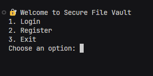
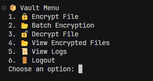

# 🔐 Encrypted File Vault CLI

A secure command-line tool to encrypt/decrypt files, store secrets, and manage user authentication using password hashing. Designed for developers, sysadmins, and security-conscious users who need fast, local data encryption and secure access.

---

## ✨ Features

- AES-based file encryption using `cryptography.fernet`
- Secure password entry with `pwinput`
- User authentication via hashed passwords (`hashlib`)
- JSON-based configuration and secret storage
- Timestamped logs and automatic backups using `datetime` and `shutil`

---

## 📁 Project Structure

```
secured_file_vault/
├── main.py
├── auth.py
├── vault.py
├── batch_processor.py
├── helper.py
├── logs/
│   └── vault_log.txt
├── users.json
├── user_files.json
├── requirements.txt
├── README.md
├── encrypted_files/
├── decrypted_files/
├── zipped_folders/
└── screenshots/
    ├── login.png
    └── main_menu.png
```


---

## ⚙️ Setup Instructions

### 1. Clone the Repository

```bash
git clone https://github.com/Crumunt/secured_file_vault.git
cd secured_file_vault
```
2. (Optional) Create a Virtual Environment
```bash
python -m venv venv
source venv/bin/activate     # On Windows: venv\Scripts\activate
```
3. Install Dependencies
Install required packages using pip:
```bash
pip install -r requirements.txt
```
Or manually install them:
```bash
pip install cryptography pwinput
```

---

## 📦 Dependencies

These packages are required by the application:

| Package       | Description                                  |
|---------------|----------------------------------------------|
| `cryptography`| Used for AES encryption via `Fernet`         |
| `pwinput`     | Allows secure password input in CLI          |
| `hashlib`     | Python standard library – password hashing   |
| `json`        | Python standard library – config/secret files|
| `os`          | Python standard library – file system access |
| `shutil`      | Python standard library – file operations    |
| `datetime`    | Python standard library – timestamps          |
| `time`        | Python standard library – delays/timing       |

> 📝 All standard libraries (`os`, `json`, `datetime`, etc.) require **no installation**.


🚀 Running the Application
```bash
python main.py
```

You’ll be prompted to:

- Register or log in

- Encrypt/decrypt files

- View Encrypted Files

- View Logs

---

## 🖼️ Screenshots

### Login Prompt


### Main Menu


## 📄 License
Licensed under the MIT License.
